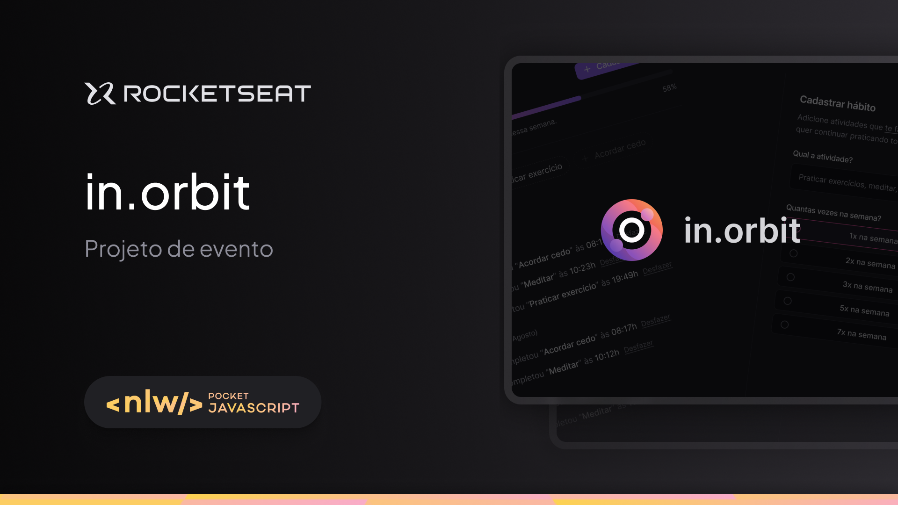
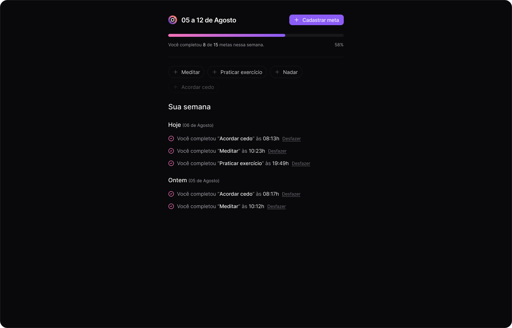

[Read this in English](README.en.md)


# 🚀 In Orbit - Gerenciador de Metas

<div align="center">

  
  &nbsp;&nbsp;
  

</div>

<p align="center">
  
</p>

<p align="center">
  
</p>

## 🎯 Sobre o Projeto

O **In Orbit** é uma aplicação web full-stack para registro e acompanhamento de metas semanais, desenvolvida durante o evento **NLW (Next Level Week) Pocket Javascript**, promovido pela Rocketseat.

O projeto foi uma oportunidade para construir uma aplicação completa do zero, integrando um back-end robusto em Node.js com um front-end reativo em React. A aplicação permite que o usuário cadastre metas, defina a frequência semanal e acompanhe seu progresso diário através de uma interface limpa e funcional.

---

## ✨ Funcionalidades Principais

-   ✅ **Cadastro de Metas:** Permite ao usuário criar novas metas e definir a frequência desejada (ex: 3 vezes por semana).
-   📅 **Acompanhamento Diário:** Interface para marcar metas como concluídas em um dia específico.
-   📊 **Visualização de Progresso:** Uma barra de progresso geral indica a porcentagem de metas concluídas na semana.
-   📝 **Histórico Semanal:** Exibe as metas concluídas nos dias anteriores da semana corrente.

---

## 🚀 Tecnologias Utilizadas

Este projeto foi construído com uma stack moderna e performática, separada em dois componentes principais: `server` (back-end) e `web` (front-end).

#### **Back-End (Server):**

-   [**Node.js**](https://nodejs.org/en) com [**TypeScript**](https://www.typescriptlang.org/)
-   [**Fastify**](https://www.fastify.io/) como framework web para construção da API REST.
-   [**PostgreSQL**](https://www.postgresql.org/) como banco de dados relacional.
-   [**Drizzle ORM**](https://orm.drizzle.team/) para a interação com o banco de dados.
-   [**Zod**](https://zod.dev/) para validação de schemas e dados de entrada.
-   [**Docker**](https://www.docker.com/) para conteinerização do banco de dados.

#### **Front-End (Web):**

-   [**React 18**](https://reactjs.org/) e [**Vite**](https://vitejs.dev/) para uma base de desenvolvimento rápida.
-   [**TypeScript**](https://www.typescriptlang.org/) para tipagem estática.
-   [**TailwindCSS**](https://tailwindcss.com/) para estilização ágil.
-   [**Tanstack Query (React Query)**](https://tanstack.com/query/latest) para gerenciamento de estado de servidor.
-   [**React Hook Form**](https://react-hook-form.com/) + [**Zod**](https://zod.dev/) para manipulação e validação de formulários.
-   [**Biome**](https://biomejs.dev/) como Linter e Formatador.

---

## ▶️ Como Rodar o Projeto Localmente

Para executar este projeto, você precisará ter o **Node.js**, **Docker** e o **WSL (Windows Subsystem for Linux)** (caso esteja no Windows) instalados em sua máquina.

Siga os passos abaixo:

```bash
# 1. Clone o repositório para sua máquina
$ git clone [https://github.com/seu-usuario/in-orbit.git](https://github.com/seu-usuario/in-orbit.git)

# 2. Acesse a pasta do projeto
$ cd in-orbit
```

### Configurando o Back-End (Server)

```bash
# 3. Entre na pasta do servidor
$ cd in-orbit__server

# 4. Instale as dependências do back-end
# Este comando lê o arquivo package.json e baixa todas as bibliotecas necessárias.
$ npm install

# 5. Inicie o banco de dados com Docker
# O Docker Compose irá ler o arquivo docker-compose.yml e criar um contêiner
# com o PostgreSQL pronto para uso. O -d executa em modo "detached" (em segundo plano).
$ docker compose up -d

# 6. Aplique as migrações no banco de dados
# O Drizzle Kit irá executar os scripts SQL para criar as tabelas necessárias no banco.
$ npx drizzle-kit migrate

# 7. Inicie o servidor back-end
# Este comando iniciará a API, que estará pronta para receber requisições.
$ npm run dev
```

### Configurando o Front-End (Web)

```bash
# 8. Volte para a raiz e entre na pasta do front-end
$ cd ../in-orbit__web

# 9. Instale as dependências do front-end
$ npm install

# 10. Inicie a aplicação React
$ npm run dev
```

Pronto! Agora você pode acessar a aplicação em [**http://localhost:5173/**](http://localhost:5173/).

---

## 🧠 Desafios e Aprendizados

Este projeto foi uma excelente oportunidade para aprofundar conhecimentos em um fluxo de trabalho full-stack. Os principais aprendizados foram:

-   **Front-End:** Foi minha primeira experiência utilizando a combinação de **React Query**, **React Hook Form** e **Zod**. A forma como essas bibliotecas se integram para manipular estado de servidor, formulários e validações de forma declarativa e segura foi um grande diferencial.
-   **Back-End:** O desafio foi **dockerizar** o ambiente de banco de dados, garantindo que qualquer desenvolvedor pudesse subir a aplicação com um único comando. Além disso, a utilização do **Drizzle ORM** para interagir com o PostgreSQL de forma tipada e segura foi um aprendizado valioso.

---

## 🎨 Layout

O design do projeto foi disponibilizado pela Rocketseat e pode ser visualizado através [**deste link do Figma**](https://www.figma.com/design/Za3qHRDkRymvqZn5VZhwLh/NLW-Pocket-JS-%E2%80%A2-in.orbit--Community-?node-id=84-333&t=flPEu1aqllGcrzd6-1).

---

## 📝 Licença

Este projeto está sob a licença MIT.
